# 연주는 모비폴리오, 생활 작업은 모비웍스

**모비공방 · 비공식 팬 프로젝트**
무료 · Windows 10 / 11 · 설치 없음

<br clear="left">

마비노기 모바일 PC판에서 쓰는 무료 도구예요. 악보를 이어서 연주하고, 채집·제작·가공을 순서대로 돌려요. 두 기능이 앱 하나에 들어 있어요.

| | |
|---|---|
| 내려받기 | **https://wo.mobimml.com/#download** — 최신판 `MobiWorks_Beta-1.0.7.zip` |
| GitHub 에서 바로 | [Releases — 최신판](https://github.com/Mobi-Lan/MobiWorks/releases/latest) 의 `MobiWorks_Beta-1.0.2.zip` — 압축을 풀고 `MobiWorks.cmd` 를 실행하면 돼요 |
| 소개 페이지 | https://wo.mobimml.com/ |

**차례** — [모비폴리오 · 악보 플레이어](#모비폴리오) · [모비웍스 · 생활 작업 큐](#모비웍스) · [모바일 리모컨](#모바일-리모컨) · [시작 전에 필요한 세 가지](#시작-전에-필요한-세-가지) · [zip 하나에 두 도구](#zip-하나에-두-도구) · [개발자를 위한 안내](#개발자를-위한-안내)

---

## 모비폴리오

**악보 플레이어**

### 악보를 모으고, 순서를 짜고, 이어서 연주하세요

게임 보관함은 긴 목록 하나라서, 곡이 끝날 때마다 다음 곡을 다시 골라야 했어요. 모비폴리오는 악보와 악기를 받아 와서 음악 플레이어처럼 찾고, 담고, 이어서 연주해요.

### 01 · 연주를 시작하면 게임 화면에 6초 연출

재생을 누르면 게임 화면 위로 곡 카드가 올라와요. 테마는 **카드형 · 필름형 · 티켓형 · 쇼츠형** 네 가지예요. **랜덤**으로 두면 매번 하나를 골라요. 연출 없이 연주만 하고 싶으면 **끄면** 돼요.

함께 지나가는 카드에는 지금 재생목록의 곡이 먼저 나오고, 남은 자리는 매번 새로 섞어요. 카드 밖은 게임 화면 그대로이고, 클릭도 게임으로 전달돼요.

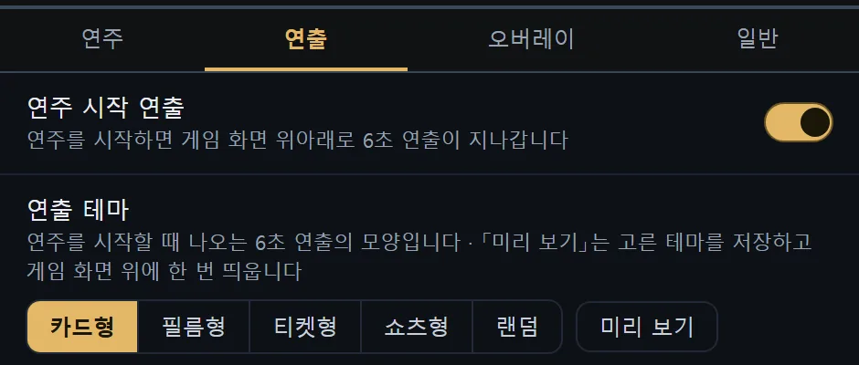

*설정 → 연출에서 켜고 테마를 골라요.*

### 02 · 게임 위에 떠 있는 플레이어

게임 화면 아래 가운데에 작은 카드가 떠요. 지금 곡과 반복 · 셔플 · 연출 상태가 보여요. 창을 오가지 않고 재생목록과 주변 연주를 펼쳐 보거나, 악기를 바꿀 수 있어요.

- 크기 50\~250%, 배경 불투명도 10\~100%
- 스마트 관통 — 평소엔 클릭이 게임으로 전달돼요
- 위치 고정 · 위치 초기화, Shift+F1 로 보이기·숨기기

### 03 · 보관함을 플레이어처럼

「갱신」을 누르면 가진 악보와 악기가 목록에 들어와요. 제목에서 아티스트를 알아서 나눠서, `아이유 - 밤편지` 는 「밤편지 · 아이유」로 보여요.

제목이나 아티스트로 검색하고, 최근 · 솔로 · 합주 칩으로 골라 볼 수 있어요. 한 번 연주한 곡은 길이를 기억해서 목록에 보여 줘요.

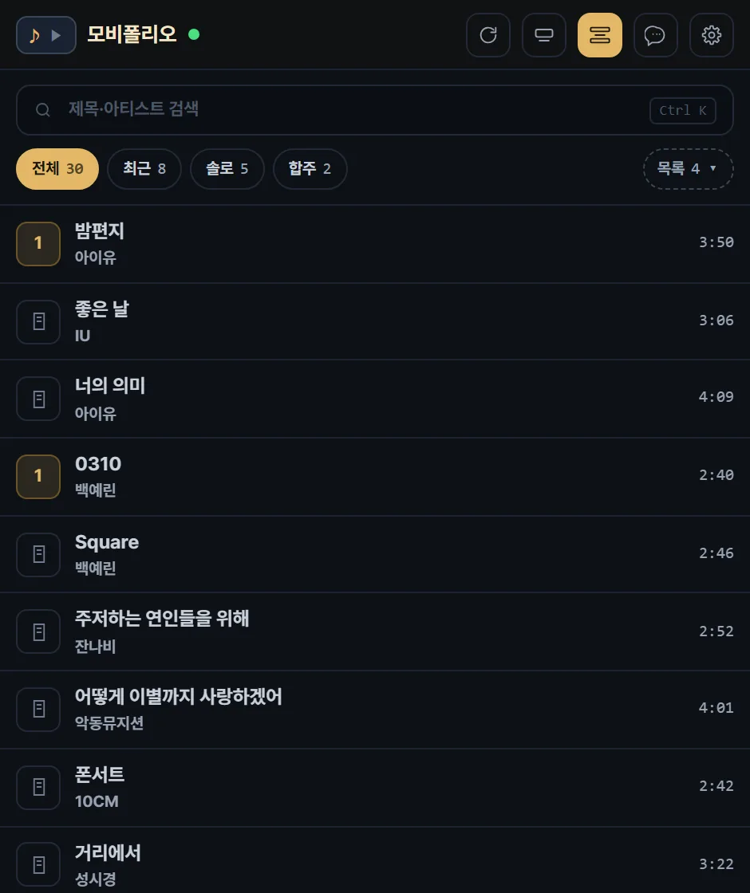

*곡 이름은 크게, 아티스트는 그 아래에 있어요. 오른쪽 숫자는 기억해 둔 곡 길이예요.*

### 04 · 재생목록으로 이어서 연주

자주 치는 곡을 재생목록에 모아 두고 「▶ 전체 재생」을 누르면 끝까지 이어서 연주해요. 순서는 목록에서 ↑ ↓로 바꿔요.

- 셔플, 반복(끔 · 전체 · 한 곡)
- 곡 사이 대기 — 기본 2초, 0\~60초
- 게임에서 직접 연주를 시작해도 플레이어가 따라가요

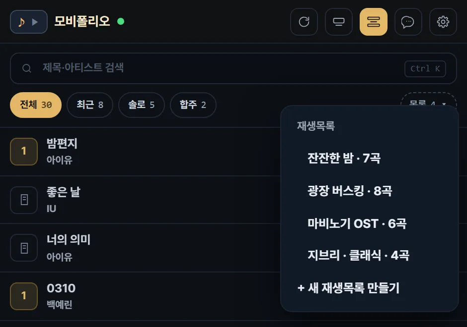

*「목록 ▾」에서 재생목록을 고르거나 새로 만들어요.*

### 05 · 곡마다 악기를 따로

곡마다 악기를 정해 두면, 그 곡 차례에 악기를 바꿔 들고 연주해요. 연주 없이 「장착」만 할 수도 있어요.

핀 모양 **악기 고정**을 켜면 곡마다 정한 악기보다 고정한 악기를 먼저 써요. 이름이 긴 악기는 앞에 [하프]처럼 종류를 붙여 보여 줘요.

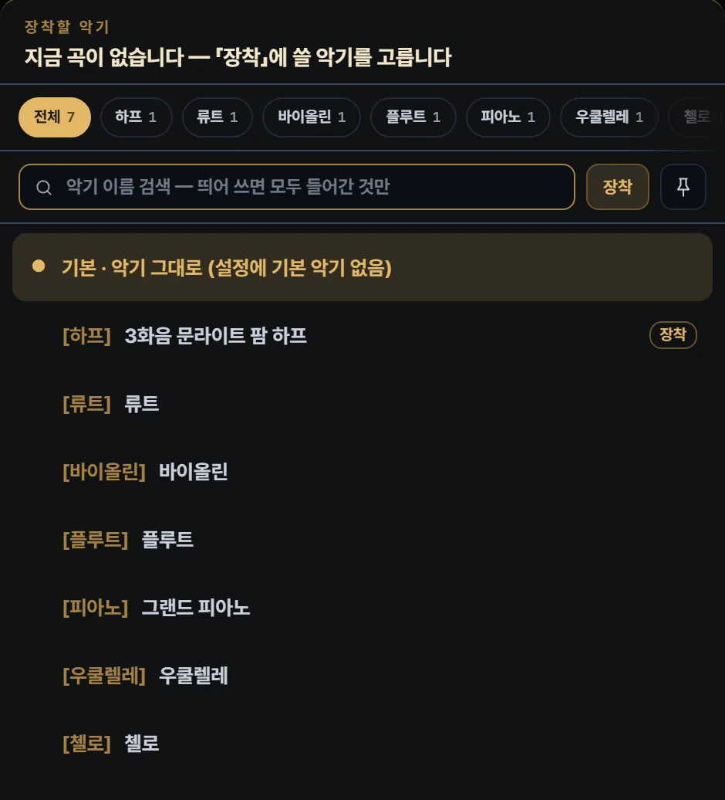

*악기 시트에서 종류별로 거르고, 검색하고, 고정할 수 있어요.*

### 06 · 곡마다 카드 커버

곡마다 번호가 붙고, 번호마다 커버가 하나씩 붙어요. 따로 고르지 않으면 무늬 위에 제목과 아티스트를 그린 **생성 커버**를 써요.

곡을 우클릭하고 「커버 고르기…」에서 **온라인에서 찾기**를 누르면, 제목과 아티스트로 앨범 그림을 찾아 줘요(Apple Music · Deezer). 하나를 고르면 이 PC에 받아서 그 곡의 커버로 써요. 내 이미지를 올리거나, `0012.png` 처럼 번호로 이름을 붙여 넣어도 돼요.

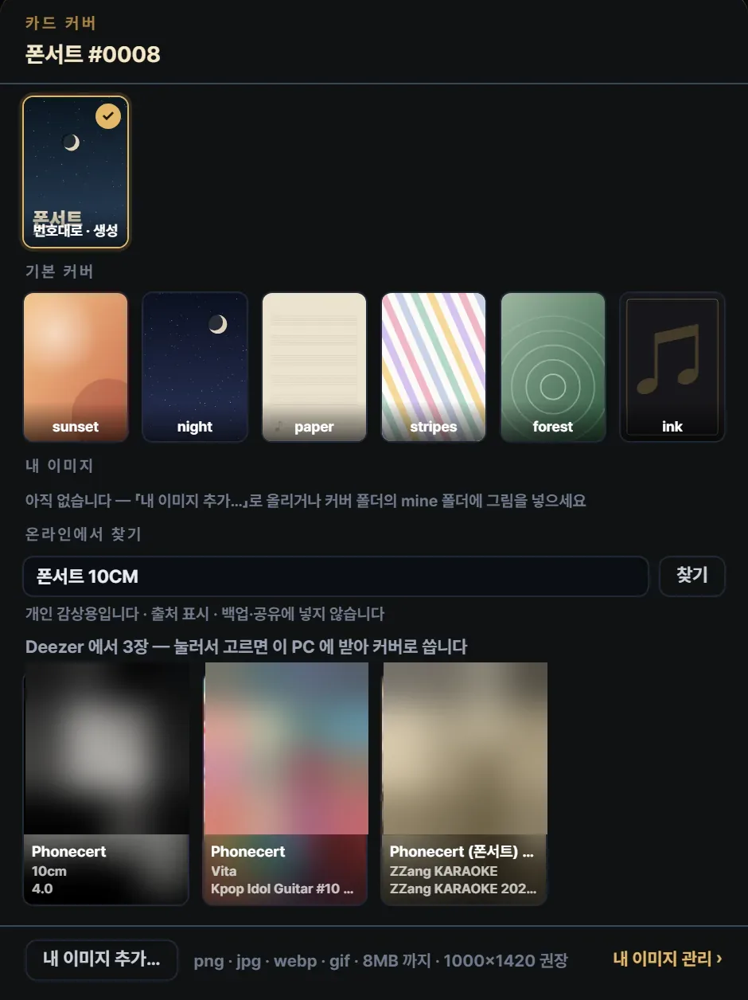

*「폰서트 10CM」로 찾은 결과예요. 첫 번째 그림을 고르면 아래 곡 설정에 들어가요. 온라인 그림은 개인 감상용이라 출처를 같이 적고, 백업·공유에는 넣지 않아요.*

### 07 · 곡 설정 한 장에 전부

곡 줄 앞의 네모를 누르거나, 곡을 우클릭하면(모바일에서는 길게 누르면) 맨 위의 「곡 설정 (악기·커버·인사)…」가 열려요. 악기 · 커버 · 연주 인사 · 담긴 재생목록을 한곳에서 바꿀 수 있어요.

번호, 길이, 재생 횟수, 처음과 마지막으로 연주한 날도 보여요.

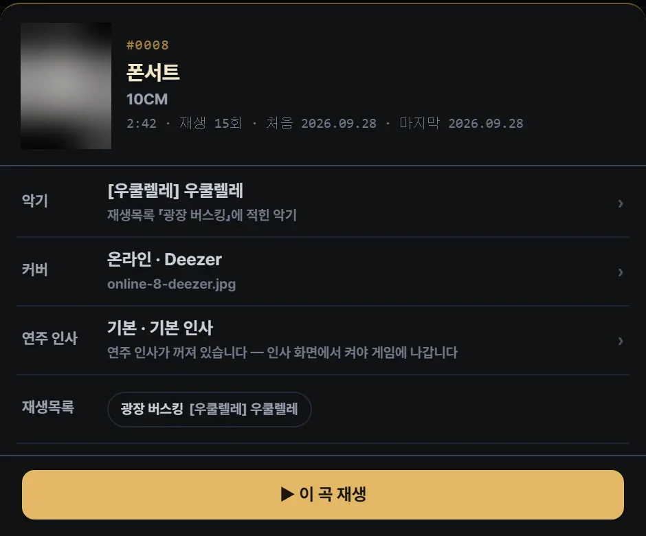

*곡 설정에서 악기 · 커버 · 연주 인사 · 재생목록을 한 번에 봐요.*

### 08 · 연주 전후에 인사

재생을 누르면 인사말 → 행동 → 표정 → 연출 → 연주 순서로 이어져요. 인사말에 `*(곡)*`, `*(아티스트)*` 를 넣으면 그 자리에 곡 이름과 아티스트가 들어가요.

- 프리셋은 시작 · 끝 · 들었을 때 세 가지이고, 무작위로 돌릴 수도 있어요
- 다른 사람의 연주가 끝나면 「잘 들었습니다」로 자동 인사해요
- 처음엔 꺼져 있어요. 켜야 게임 채팅에 나가고, 50자가 넘으면 잘려요

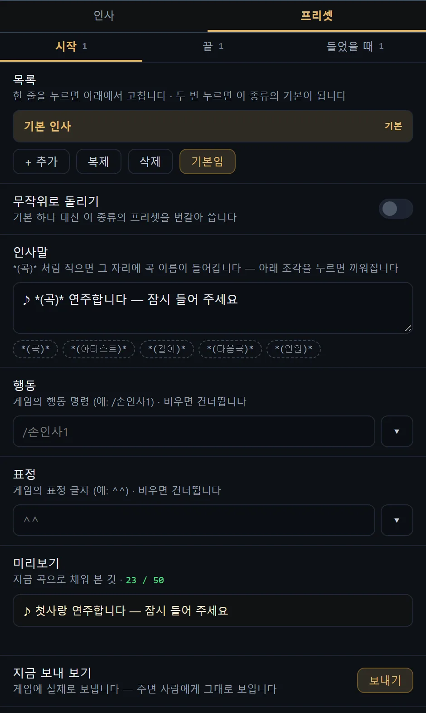

*프리셋에서 인사말 · 행동 · 표정을 정하고 미리 볼 수 있어요.*

### 09 · 합주를 알아봐요 <sub>(Beta)</sub>

나와 같은 순간에 연주를 시작한 사람이 있으면 합주로 알아봐요. 합주하는 동안에는 혼자 멈추거나 다음 곡으로 넘어가지 않아요.

합주가 끝나면 「다음 곡 / 그만」을 물어봐요. 곡마다 합주 인원을 적어 두면 솔로 · 합주 칩으로 나눠 볼 수 있어요. 설정에서 끌 수도 있어요.

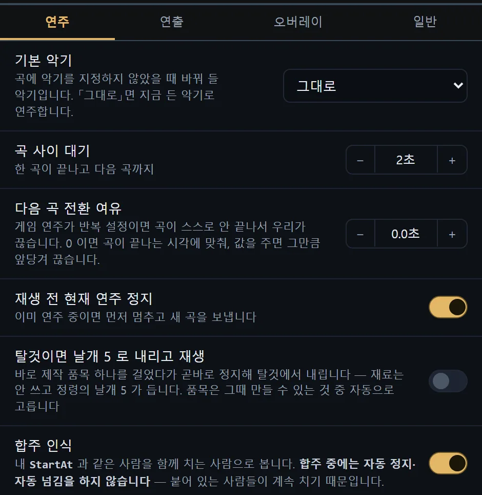

*설정 → 연주에서 합주 인식과 곡 사이 대기 시간을 정해요.*

### 10 · 작업에 양보

모비웍스 큐가 「이 곡 끝나면 양보」로 기다리고 있으면, 모비폴리오는 지금 곡이 끝날 때 멈춰요. 다음 곡으로 넘어가지 않아요.

작업이 끝나도 알아서 다시 틀지 않아요. 「▶」를 누르면 이어서 재생해요.

> 흐름 (설명용 도식)
> ♪ 연주 중인 곡 → **곡 끝 · 멈춤** → ∞ 큐 작업 → ▶ 누르면 이어서

---

## 모비웍스

**생활 작업 큐**

### 생활 작업, 걸어두고 잊으세요

채집 · 제작 · 가공을 큐에 담아 두면 재료를 확인하고 순서대로 실행해요. 가공대에 걸어 둔 건 끝나는 대로 받아요. 실행할 때마다 정령의 날개를 5개씩 써요. 게임 규칙 그대로이고, 앱이 더 쓰지는 않아요.

### 01 · 대기 → 작업 중 → 완료 · 실패

할 일이 카드가 되어 네 칸을 지나가요. 카드 **사이**로 끌면 순서가 바뀌고, 카드 **가운데**에 겹치면 그룹이 돼요. 창이 좁으면 칸이 탭으로 접혀요.

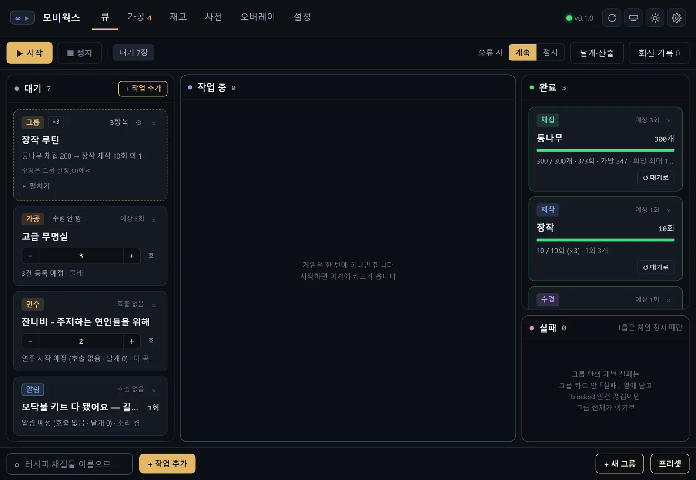

*넓은 창에서는 네 칸이 한눈에 보여요.*

### 02 · 게임 위 한 줄 띠

게임 화면 위쪽 가운데에 진행 상황이 얇은 띠로 떠요. 몇 번째 카드인지, 대기 · 완료 · 실패 수, 가공 남은 시간을 한 줄로 보여 줘요.

- 평소엔 클릭이 게임으로 전달돼요
- 띠를 펼치면 가공기 현황이 보이고, 거기서 바로 일괄 수령해요
- 큐가 멈춰 있을 땐 오늘 쓴 날개와 얻은 양을 보여 줘요
- 처음엔 꺼져 있어요. 오버레이 탭에서 켜요

### 03 · 담기 서랍 하나로

「＋ 작업 추가」를 누르면 서랍이 열려요. **채집 · 제작 · 가공 · 수령 · 연주 · 알림**을 한곳에서 골라 대기 열이나 그룹에 담아요.

- 채집은 100개씩 담아요. 도구가 없으면 미리 알려 줘요
- 가공은 「가공만 걸기」와 「가공 후 수령까지」 중에 골라요
- 담을 때 모자란 재료도 같이 추천해요

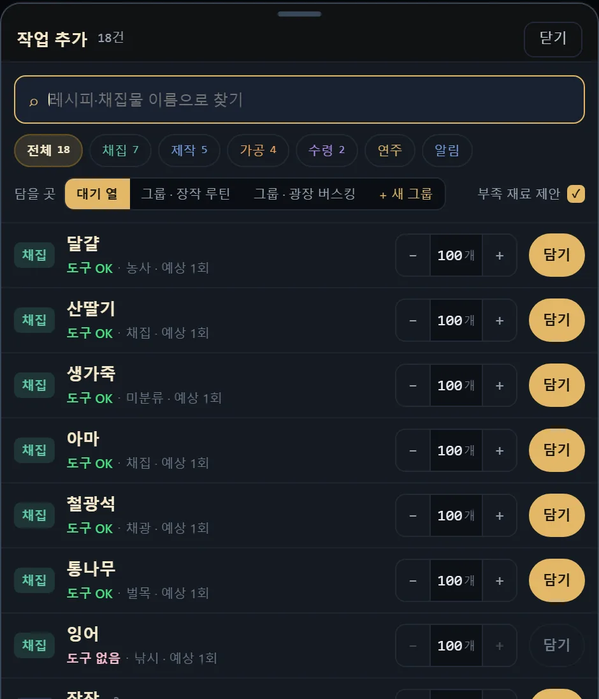

*칩 일곱 개로 나눠 보고, 대기 열이나 그룹에 담아요.*

### 04 · 묶어서 반복하는 그룹

「통나무 채집 → 장작 제작 → 모닥불 키트」처럼 여러 카드를 묶고, 몇 번 반복할지 정해요(1\~20회). 남은 횟수, 예상 호출 수, 쓸 날개가 바로 계산돼요.

오류가 나면 계속할지 멈출지, 실패한 항목을 회차마다 다시 할지, 가공이 끝날 때까지 기다릴지를 그룹마다 정할 수 있어요.

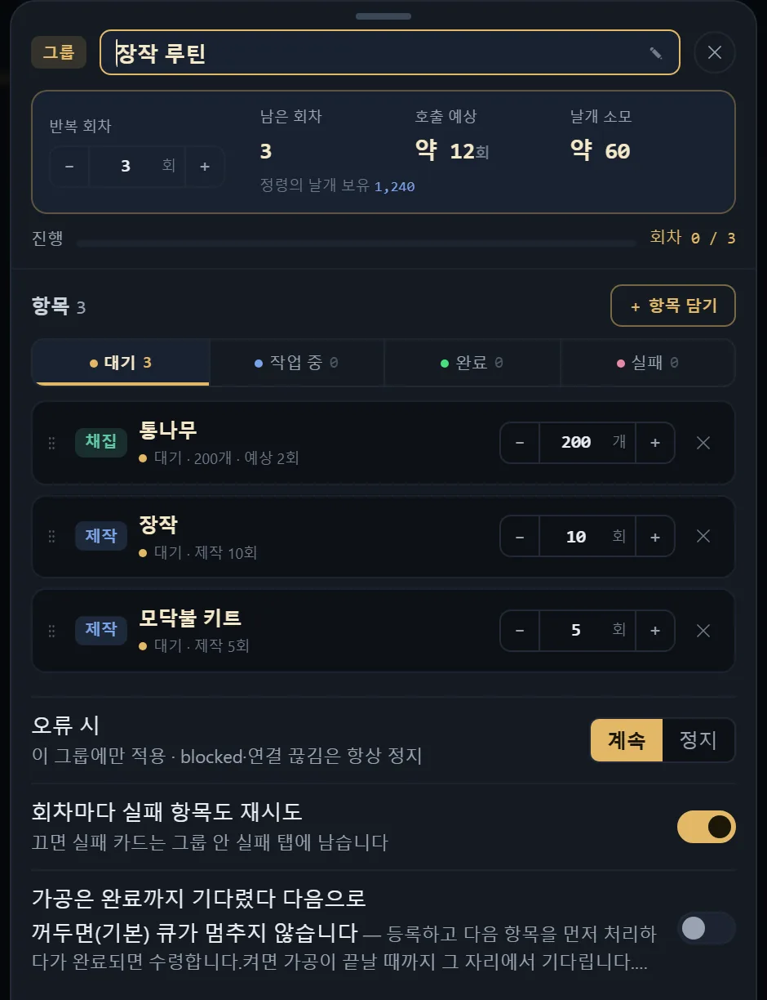

*3번 반복하면 날개가 약 60개 들어요. 담기 전에 미리 보여 줘요.*

### 05 · 큐에 연주를 끼워 넣기

**연주 카드**는 차례가 오면 모비폴리오에 연주를 맡기고, 정한 곡과 횟수가 다 끝나면 다음 카드로 넘어가요. 게임 호출도, 날개도 쓰지 않아요.

「이 곡만」, 「재생목록」, 「대기열 이어서」 중에 골라요. 재생목록을 담으면 곡마다 카드가 하나씩 든 그룹이 돼요.

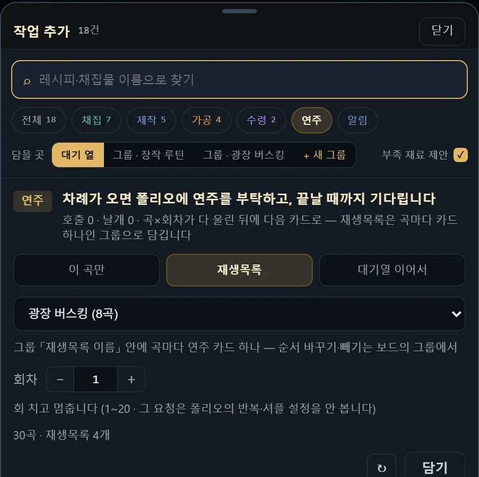

*재생목록 「광장 버스킹」을 담으면 8곡짜리 그룹이 돼요.*

### 06 · 알림 카드 · 큐 종료 알림

큐 중간에 **알림 카드**를 넣어 두면 차례가 왔을 때 알려 줘요. 게임 위 띠, 앱 창, 열어 둔 모바일 화면에 같이 떠요.

큐가 끝나면 「큐가 끝났습니다 — 완료 n · 실패 m」으로 알려요. 직접 ■ 정지했을 땐 알리지 않아요.

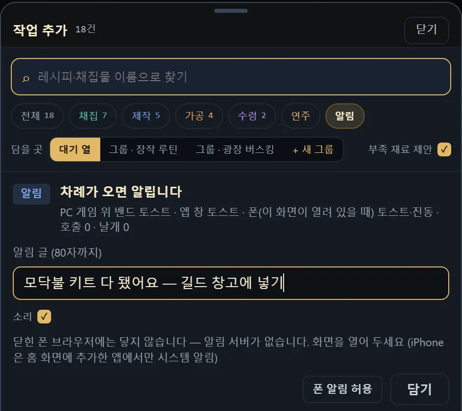

*알림 글은 80자까지 쓸 수 있고, 소리는 켜고 끌 수 있어요.*

### 07 · 연주와 작업, 누가 먼저

왼쪽 레일의 우선 스위치를 누를 때마다 세 가지 설정이 차례로 바뀌어요. 연주 중에 ▶ 시작을 누르면, 작업 중 칸 맨 위에 **연주 대기 카드**(날개 0)를 띄우고 기다려요. 연주가 끝나면 알아서 시작해요.

| 우선 스위치 세 자리 | |
|---|---|
| ♪ **연주 우선 (기본)** | 재생목록이 다 끝나면 작업을 시작해요. |
| ⏭ **이 곡 끝나면 양보** | 지금 곡만 마치고 작업에 차례를 넘겨요. |
| ∞ **작업 우선** | 바로 시작해요. 연주는 멈춰요. |

### 08 · 시작 전에 한 번 더 보여 줘요

「▶ 시작」을 누르면 바로 실행하지 않고 확인창부터 열어요. 항목 수, 예상 호출 수, 쓸 날개와 실행 뒤 남는 날개를 먼저 보여 줘요.

캐릭터 상태도 확인해요(사망 · 부활 · 전투 · 대화 · 던전 · 전장, 연주 카드는 탈것까지). 시작할 수 없는 상태면 「시작」이 잠겨요. 게임에서 상태를 바꾼 뒤 「↻ 다시 확인」을 누르면 돼요.

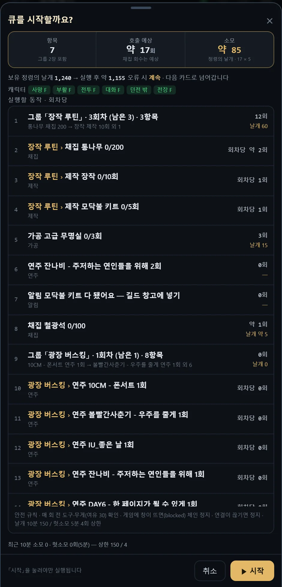

*「시작」을 눌러야 실행돼요.*

### 09 · 날개 차단기

뭔가 잘못돼서 날개가 계속 빠져나가지 않도록, 두 가지 상한을 넘으면 큐를 멈춰요.

- 10분 동안 날개를 150개 넘게 쓰면 멈춰요
- 5분 동안 아무것도 얻지 못한 호출(헛소모)이 4번이면 멈춰요
- 상한은 설정 → 제작·채집 큐에서 바꿀 수 있어요
- 매번 실행 전에 도구와 무게(여유 30)를 확인하고, 게임에 창이 뜨거나 연결이 끊기면 멈춰요

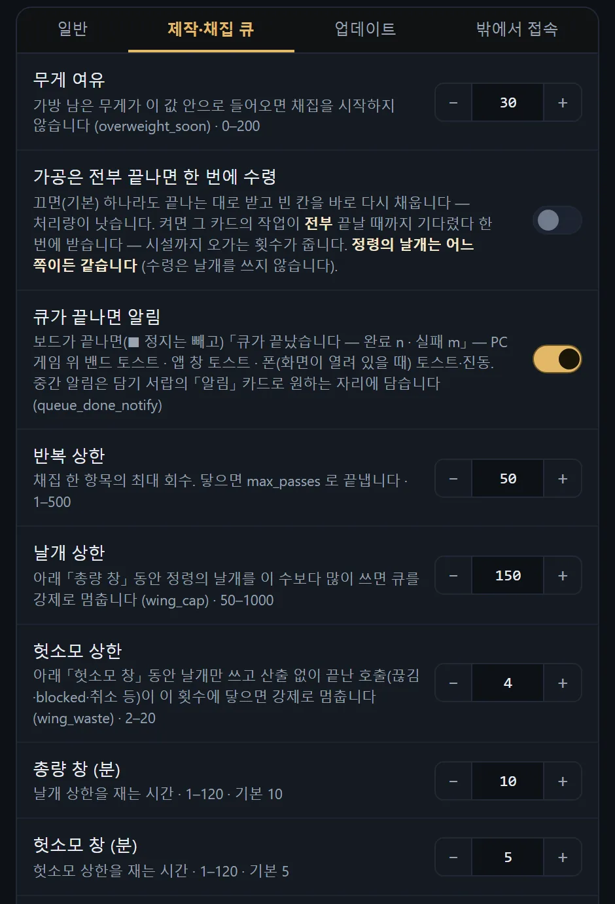

*날개 상한 150, 헛소모 상한 4, 기준 시간은 10분과 5분이에요.*

### 10 · 가공 대기열과 확실한 수령

시설마다 걸어 둔 가공과 남은 시간을 한 화면에서 봐요. 끝난 건 「전체 수령」 한 번으로 받아요. 수령할 땐 날개를 쓰지 않아요.

게임이 「수령분 없음」이라고 답해도 바로 실패로 보지 않아요. 5초 뒤 대기열을 다시 확인하고, 3번까지 다시 받아요.

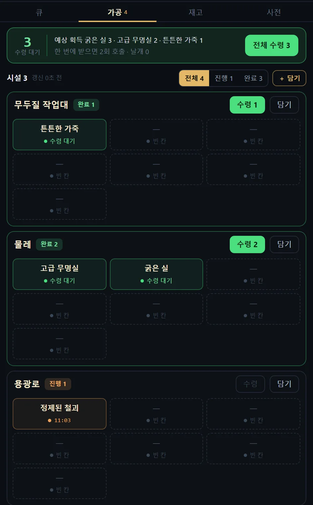

*가공 탭에서 수령 대기와 시설별 남은 시간을 봐요.*

### 11 · 오늘 날개를 얼마나 썼나

실행할 때마다 기록을 한 줄씩 남겨요. 「오늘 날개 30 · 통나무 300 · 외 2 · 실패 5」처럼 오늘 요약, 최근 7일 합계, 날짜별 막대를 보여 줘요. 기록은 90일 동안 보관해요.

실패한 호출은 따로 세고, 모바일에서 실행한 건 「밖에서」로 구분해요.

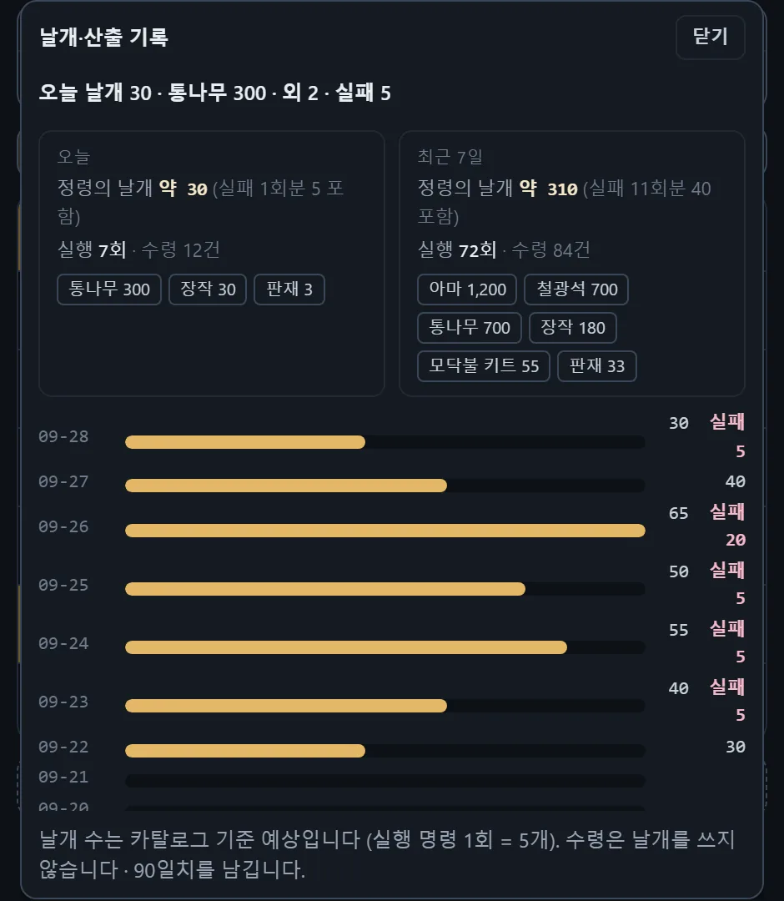

*날개·산출 기록에서 오늘, 최근 7일, 날짜별로 봐요.*

### 12 · 재고와 레시피 사전

**재고** 탭에서는 가방 무게와 여유 무게, 가방 · 창고 · 합계를 한 표로 봐요. 자주 보는 재화는 위에 고정할 수 있어요.

**사전**에서는 레시피로 재료를, 재료로 쓰이는 곳을 찾아요. 쓸수록 직접 확인한 레시피가 쌓여서 더 정확해져요.

<table>
<tr>
<td>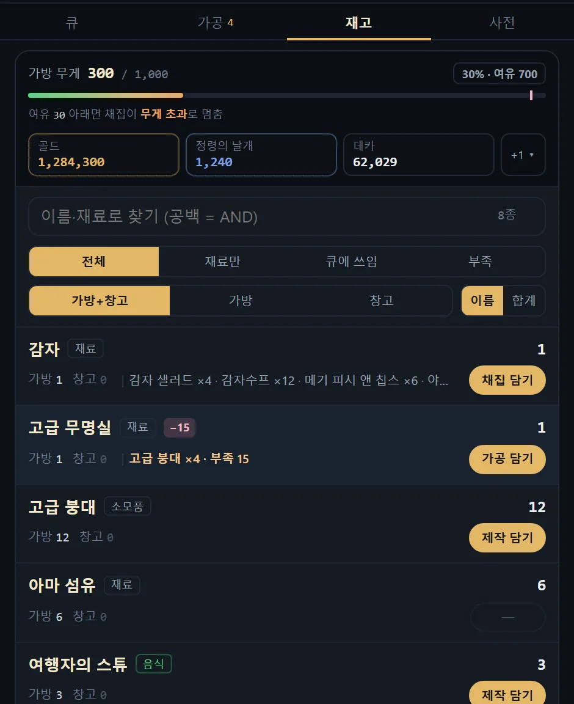</td>
<td>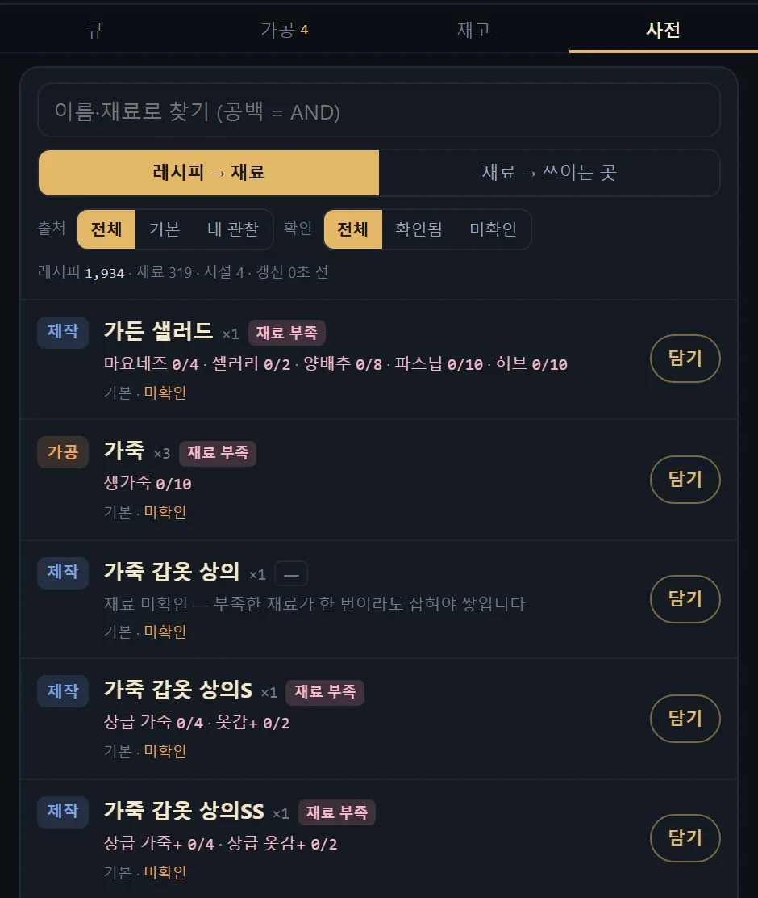</td>
</tr>
<tr>
<td><em>재고</em></td>
<td><em>사전</em></td>
</tr>
</table>

---

## 모바일 리모컨

### 자리를 비워도 모바일로

밖에서도 모바일 브라우저로 큐와 재생목록을 볼 수 있어요. 화면이 모바일에 맞게 바뀌고, 홈 화면에 앱처럼 추가할 수도 있어요. 공유기는 따로 설정하지 않아도 돼요.

<table>
<tr>
<td>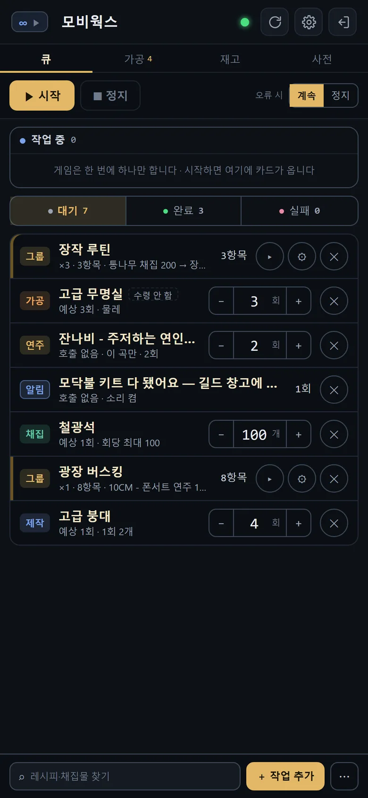</td>
<td>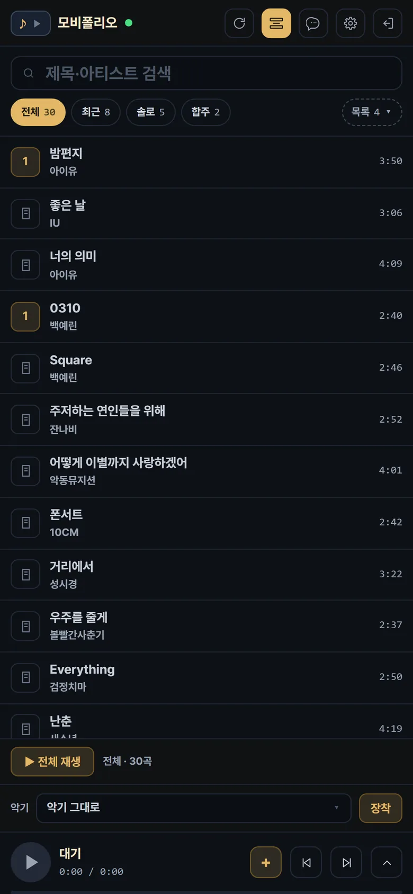</td>
<td>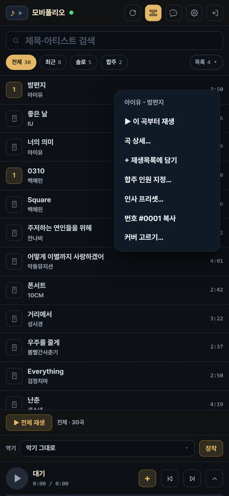</td>
<td>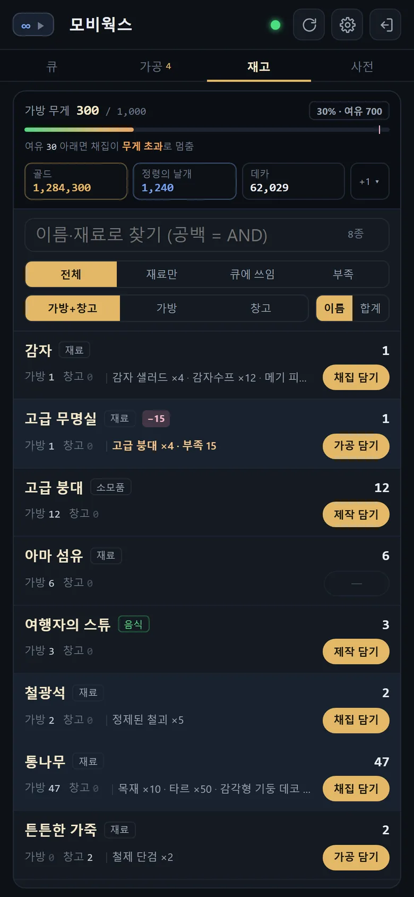</td>
</tr>
</table>

### 연결 · 코드 한 번, 인증키 한 번

모바일에서 `link.mobimml.com` 을 열어요. PC의 설정 → 밖에서 접속에서 받은 **8자 연결 코드**를 입력하거나 QR을 찍고, **인증키**를 한 번 넣으면 그 기기를 기억해요.

- 모바일에 줄 수 있는 범위는 **보기만**(기본) · **큐 편집** · **실행까지** 세 가지예요
- 「실행까지」를 줘야 모바일에서 ▶ 시작 · ■ 정지를 할 수 있어요. 날개는 이때만 써요
- 모바일은 PC가 읽어 둔 정보만 봐요. 게임에 직접 묻지 않아요
- 「모든 기기 끊기」로 한 번에 끊을 수 있어요. 아무 요청이 없으면 연결을 알아서 닫아요(기본 30분)

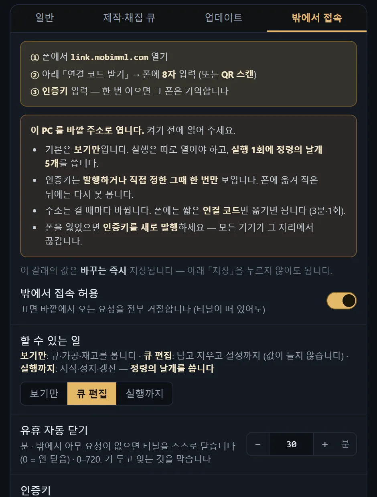

*PC의 설정 → 밖에서 접속 화면이에요.*

**앱은 내 PC 안에서만 열려요.**
앱은 내 PC 주소(`127.0.0.1`)에서만 열리고, 실행할 때마다 포트와 비밀 토큰이 바뀌어요. 밖에서 접속을 켜지 않으면 바깥에서 들어올 수 없어요.

**주소는 잠가서 맡겨요.**
모바일에 넘길 접속 주소는 인증키로 잠근 뒤 우편함 서버에 맡겨요. 연결 코드만 아는 사람도, 우편함 서버도 주소를 볼 수 없어요.

**틀리면 잠겨요.**
인증키를 **5번 틀리면 10분 동안 잠겨요.** 연결 코드는 **3분 안에 한 번만** 쓸 수 있어요.

**기록은 내 PC에만 남아요.**
재생목록 · 큐 · 기록은 `%LOCALAPPDATA%\MobiWorks` 에만 저장돼요. 계정 정보도, 사용 기록도 밖으로 보내지 않아요.

---

## 시작 전에 필요한 세 가지

1. **Windows 10 또는 11**
2. **마비노기 모바일 PC 클라이언트** — 환경 설정 → 게임 → AI 제어에서 「AI 커넥터」를 켜 주세요.
   일주일 동안 쓰지 않으면 저절로 꺼지니, 오랜만에 쓸 땐 한 번 확인해 주세요.
3. **Microsoft Edge** — 앱이 Edge 창으로 열려요. Windows에 기본으로 들어 있어요.

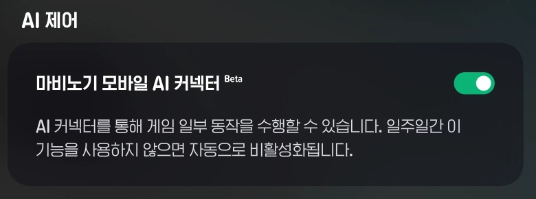

*게임의 환경 설정 → 게임 → AI 제어에서 「AI 커넥터」를 켜요.*

---

## zip 하나에 두 도구

zip 파일 하나에 모비폴리오와 모비웍스가 같이 들어 있어요. 설치 없이 압축만 풀면 되고, 지울 땐 폴더만 지우면 돼요
(시작 메뉴의 「모비웍스」도 같이 지워 주세요. 기록까지 지우려면 `%LOCALAPPDATA%\MobiWorks` 폴더도 같이 지워요).

1. [Windows용 내려받기](https://wo.mobimml.com/#download)에서 `MobiWorks_Beta-1.0.7.zip` 을 받아요. [GitHub Releases](https://github.com/Mobi-Lan/MobiWorks/releases/latest)에서도 같은 파일을 받을 수 있어요. 무료 · Windows 10 / 11.
2. 원하는 곳에 압축을 풀어요. `MobiWorks` 폴더가 생겨요.
3. 폴더 안의 `MobiWorks.cmd` 를 실행해요. 검은 창이 잠깐 떴다가 닫히고 앱 창이 열려요.
4. 한 번 실행하면 시작 메뉴에 「모비웍스」가 생겨요. 다음부터는 거기서 켜면 돼요. 바탕화면에 두고 싶다면 설정 → 일반 → 「바탕화면에 바로가기 만들기」를 눌러요.

인터넷에서 받은 파일이라 처음 실행할 때 Windows 가 한 번 물어볼 수 있어요.
「열려 있는 파일 - 보안 경고」 창이 뜨면 「실행」을, 「Windows의 PC 보호」 창이 뜨면 「추가 정보」 → 「실행」을 누르면 돼요.
압축을 풀기 전에 zip 파일을 오른쪽 클릭 → 속성 → 아래쪽 「차단 해제」에 체크하고 확인을 누르면 이 창이 뜨지 않아요.

앱을 실제로 돌리는 것은 python.org 가 배포하는 공식 파이썬(`python\pythonw.exe`, Python Software Foundation 서명)이고,
모비웍스 자체는 `app\` 폴더의 소스 파일 그대로예요. 따로 만든 실행 파일은 들어 있지 않아요.

새 판이 나오면 앱이 알려 줘요. 1.0.2 부터는 앱 안에서 「지금 업데이트」로 바로 새 판을 받아요 (1.0.1 이하는 한 번 새로 받아 주세요).
앱이 잠깐 닫혔다 다시 열리고, 기록 · 설정은 그대로 남아요.

받은 파일이 맞는지 확인하고 싶다면 [SHA256SUMS.txt](https://wo.mobimml.com/SHA256SUMS.txt) 의 값과 비교해 보세요. PowerShell 에서
`Get-FileHash .\MobiWorks_Beta-1.0.7.zip -Algorithm SHA256` 으로 확인할 수 있어요.

---

모비폴리오와 모비웍스는 개인이 만든 비공식 팬 프로젝트입니다. 넥슨 및 데브캣과 아무런 관계가 없으며, 공식 지원을 받지 않습니다.
마비노기 모바일과 관련 상표에 대한 권리는 각 권리자에게 있습니다. 소스는 [MIT 라이선스](LICENSE)로 공개되어 있습니다.

이 문서의 앱 화면은 예시 자료로 촬영했습니다. 곡 제목과 수치는 실제 사용자의 것이 아닙니다.

© 2026 모비공방 · 란님

---

## Privacy policy / 개인정보

This program will not transfer any information to other networked systems unless specifically requested by the user or the person installing or operating it, with the following exceptions, each of which the user can turn off or only happens after the user turns it on:

1. **Update check** — at startup the app downloads `https://wo.mobimml.com/latest.json` (and, when the user accepts an update, opens the download page of the same site in the default browser). No personal data is sent. It can be turned off in Settings.
2. **Phone remote** (off by default) — only when the user turns it on: the app starts a [Cloudflare Quick Tunnel](https://www.cloudflare.com/privacypolicy/) (`cloudflared`, downloaded once from GitHub on first use) and stores the tunnel address, encrypted with the user's key, in the mailbox at `https://link.mobimml.com` (run by this project) so the user's phone can find it. The mailbox cannot read the address.
3. **Online cover search** — only when the user presses 「온라인에서 찾기」: the song title and artist are sent to the [iTunes Search API](https://www.apple.com/legal/privacy/) or [Deezer API](https://www.deezer.com/legal/personal-datas) to find album art.

Play lists, queues, logs and settings stay on this PC in `%LOCALAPPDATA%\MobiWorks`. The app collects no account data and no usage statistics.

이 프로그램은 사용자가 직접 요청하지 않는 한 어떤 정보도 다른 네트워크 시스템으로 보내지 않습니다. 예외는 아래 세 가지뿐이고, 모두 끌 수 있거나 사용자가 켤 때만 동작합니다.

1. **업데이트 확인** — 시작할 때 `https://wo.mobimml.com/latest.json` 을 받아 옵니다 (업데이트를 수락하면 같은 사이트에서 새 판 zip 을 받아 서명·해시를 확인한 뒤 설치 폴더에서 바꿉니다 — 1.0.1 이하는 내려받기 페이지를 기본 브라우저로 엽니다). 개인 정보는 보내지 않습니다. 설정에서 끌 수 있습니다.
2. **모바일 리모컨** (기본 꺼짐) — 켤 때만 Cloudflare 터널(`cloudflared`, 처음 한 번 GitHub 에서 받음)을 열고, 접속 주소를 인증키로 잠가 `https://link.mobimml.com` 우편함에 맡깁니다. 우편함은 주소를 볼 수 없습니다.
3. **온라인 커버 찾기** — 「온라인에서 찾기」를 누를 때만 곡 제목과 아티스트를 iTunes Search API 또는 Deezer API 로 보냅니다.

재생목록 · 큐 · 기록 · 설정은 이 PC의 `%LOCALAPPDATA%\MobiWorks` 에만 저장됩니다. 계정 정보와 사용 통계는 모으지 않습니다.

---

## 개발자를 위한 안내

표준 라이브러리만 써요. Python 3.12 · Windows.

```
run.cmd            실제 CLI (게임이 켜져 있어야 갱신됨)
run.cmd --demo     데모 데이터 — 게임·CLI 없이 화면만 확인
run.cmd --nocli    실데이터 폴더 + CLI 호출 차단 (게임 켜진 채로 안전하게 화면 확인)

release.cmd https://<도메인>      -> zip 빌드(tools\build_embed.py) + latest.json + SHA256SUMS, 세 곳의 해시 대조
python release.py --stage-only   -> 도메인 없이 release\ 에 zip + SHA256SUMS 만
```

주소는 `http://127.0.0.1:19995` 이고, 앱 창이 자동으로 열려요. Ctrl+C 로 종료해요.
`store.py` 의 `DEFAULT_UPDATE_URL` 은 zip 안의 소스에 박히는 값이라, 배포 도메인을 바꾸면 그것부터 고치고 다시 빌드해요.

**배포판 = 임베디드 파이썬 zip (1.0.1 부터)** — 우리 exe 없이, python.org 공식 임베디드 패키지의 `pythonw.exe`
(Python Software Foundation 서명)가 `.py` 소스를 그대로 돌려요. PyInstaller exe 가 Defender 에 오탐돼서 바꿨어요.

```
python tools\build_embed.py --out-dir build\embed-out   -> MobiWorks_Beta-<버전>.zip   (Python 3.12.10 공식판으로 실행)

MobiWorks\MobiWorks.cmd          실행기 — MOBIW_EMBED=1 을 넣고 python\pythonw.exe app\server.py 를 띄움
MobiWorks\python\                임베디드 패키지(SHA256 고정) + tkinter 조각 (오버레이·연출용)
MobiWorks\app\                   exe 에 묶던 것과 같은 소스·화면·시드·WebView2 로더 + 표지 파일 EMBED
```

- 임베디드 판이면 exe 와 같은 배포판 규칙으로 돌아요 (경량판 앱 창, `%LOCALAPPDATA%\MobiWorks`, 개발용 환경변수 무시, https 업데이트만). 스위치는 `runmode.py` 한 곳에 있어요 — `MOBIW_EMBED=1` 이거나, 환경변수가 없어도 zip 의 짜임(`python\pythonw.exe` + 옆의 `app\EMBED`)이면 임베디드 판이에요.
- 켤 때마다 시작 메뉴 「모비웍스」 바로가기(아이콘 `app\ui\icon.ico`)를 만들거나 고쳐요 (`shortcut.py`, ctypes 로 `IShellLinkW` — PowerShell 을 띄우지 않아요). `.cmd` 에는 아이콘을 붙일 수 없어서예요. 폴더를 옮기면 다음 실행 때 새 경로로 다시 써요.
- **제자리 업데이트 (1.0.2 부터, `updater.py`)** — `latest.json` 의 `zip` 칸(주소·SHA256·크기)을 보고 새 zip 을 `<설치 폴더>\.update\` 에 받아요. https 만 · 100 MB 상한 · SHA256 대조 · zip 짜임과 이름 검사(zip-slip) · 풀린 판의 VERSION · 모든 .exe·.dll·.pyd 의 Authenticode(PSF·Microsoft, WinVerifyTrust) 를 통과해야 바꿔요. `python\` 이 같으면 앱이 `app\` 만 바꾸고 새 판을 새 포트로 띄워 응답을 본 뒤 자리를 넘겨요 (열린 창이 그대로 이어져요). `python\` 이 다르면 실행 중인 `pythonw.exe` 가 그 폴더를 잡고 있어서, 작은 도우미(`.update\swap.py`)가 앱이 끝난 뒤에 바꾸고 다시 띄워요. 어디서 실패하든 옛 판이 그대로 남고(새 판이 안 뜨면 되돌려요), 기록은 자료 폴더의 `update.log` 에 남아요. `zip` 칸이 없는 옛 `latest.json` 이면 예전처럼 「받는 곳 열기」로 `/#download` 를 열어요.
- `latest.json` 의 `url` 은 zip 이 아니라 받는 곳(`/#download`)이에요 (zip 주소는 `zip.url` — zip 을 `latest.json` 과 같은 곳에 올려요). 1.0.0 exe 의 업데이터는 `url` 을 받아 해시가 맞으면 제 exe 자리에 넣기 때문에, zip 을 가리키면 exe 가 zip 으로 덮여요. 페이지는 해시가 안 맞아 아무것도 바꾸지 않아요 (`release.py`).
- 실행기를 띄우면 콘솔 창이 잠깐 떴다가 닫혀요 (.cmd 라서).

```
server.py                 로컬 HTTP 서버 · 라우팅 · 토큰 · 업데이트 (진입점)
workqueue.py · work.py    작업 큐 실행 · 가공 대기열
recipedb.py · categories.py   관찰 누적 레시피 DB · 분류
store.py · datadir.py     설정·캐시 저장 · 자료 폴더
runmode.py · shortcut.py  실행 방식 (exe · 임베디드 파이썬 · 개발 소스) · 시작 메뉴 바로가기
updater.py                임베디드 판의 제자리 업데이트 (zip 검사 · 서명 · 바꿔 끼우기 · 도우미)
cli_transport.py · demo_cli.py   CLI 호출 계층 · 가짜 CLI (데모)
viewmodel.py              화면용 값 계산 (PC·모바일 공용)
ledger.py · presets.py    날개·산출 기록 · 큐 프리셋
questwatch.py · inst_picker.py   채집 퀘스트 감시 · 오버레이 악기 고르기
tunnel.py · mailseal.py   모바일 원격 (터널 · 주소 봉투)
overlay.py (+ bandpaint · panelpaint · paint32)   게임 위 오버레이
release.py · tools/build_embed.py   릴리스 준비·대조 · 배포 zip 만들기
folio/                    모비폴리오 엔진 · 라이브러리 · 연출 · 오버레이
ui/                       화면 (HTML/CSS/JS, 빌드 도구 없음) — ui/folio/ 는 모비폴리오 화면
data/ · fixtures/         시드 레시피 DB · CLI 실제 응답 표본 (데모용)
vendor/                   WebView2Loader.dll (연출용, vendor/README.md 참고)
docs/CLI.md               AI 커넥터(CLI) 명령 레퍼런스
docs/images/              이 문서의 화면 캡처 (소개 페이지와 같은 것)
```

> 게임 CLI 를 실제로 부르는 시험은 실행 중인 게임을 진짜로 조작해요. 그래서 **사람이 그때그때 승인할 때만** 해요.
> 승인 없이는 `--demo` / `--nocli` / `MOBIW_NO_CLI=1` 로 확인해요. 코드 주석이 가리키는 다른 설계 문서와 단위 검사는 개발 저장소에만 있어요.
